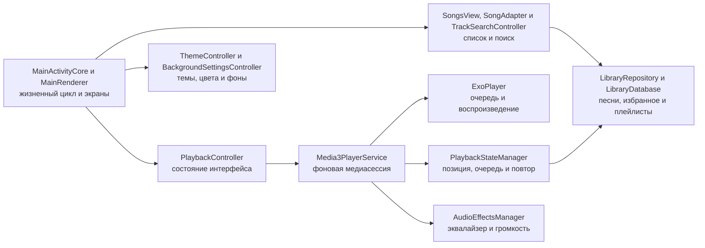
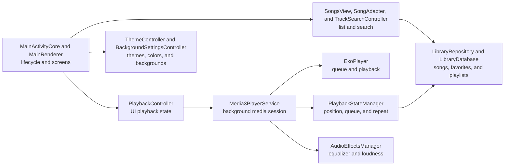

<a id="russian"></a>

<p align="center">
  
</p>

<h1 align="center">Voltune</h1>

<p align="center">
  <strong>Ваша музыка. Ваши правила. Никаких аккаунтов и подписок.</strong>
</p>

<p align="center">
  Красивый и быстрый локальный музыкальный плеер для Android, созданный для коллекции, которая уже хранится на телефоне.
</p>

<p align="center">
  <a href="../../releases/latest/download/MP3-Player-Voltune.apk">
    
  </a>
  <a href="#english">
    
  </a>
</p>

<p align="center">
  
  
  
</p>

Voltune превращает папку с музыкой в удобную личную медиатеку. Приложение быстро находит нужный трек, продолжает играть в фоне, помнит очередь и позицию, а внешний вид можно настроить под себя. Музыка остаётся на устройстве: для прослушивания не нужны интернет, регистрация или облачный сервис.

## Почему Voltune

| Преимущество | Что получает пользователь |
| --- | --- |
| **Музыка без ограничений** | Все функции бесплатны, нет подписки и закрытых возможностей. |
| **Надёжное воспроизведение** | Media3, фоновый сервис, восстановление очереди, повтор песни или списка и таймер сна. |
| **Личная медиатека** | Импорт отдельных файлов, нескольких песен или целой папки через безопасный системный выбор Android. |
| **Интерфейс под себя** | Темы, цвета, фоны, прозрачность карточек, частицы и вращающиеся обложки. |
| **Быстрая работа** | `RecyclerView`, фоновая загрузка библиотеки, кэш обложек и поиск без блокировки интерфейса. |
| **Телефон и планшет** | Макет автоматически адаптируется к размеру экрана без отдельной настройки. |

## Большая библиотека остаётся удобной

Песни, избранное, плейлисты, похожие треки, жанры, исполнители и альбомы собраны в понятные разделы. Доступны поиск, сортировка, случайное и последовательное воспроизведение, ручная очередь и добавление треков в коллекции. Даже большая медиатека открывается без создания тысяч невидимых карточек.

Вкладка «Похожие» локально анализирует звучание и адаптивно объединяет близкие треки по энергии, динамике, спектру и тембру. BPM не влияет на расстояние, состав или название групп. Аудио и профили не отправляются в интернет.

<p align="center">
  
</p>

## Полный контроль над воспроизведением

Мини-плеер всегда оставляет основные действия под рукой, а большой плеер показывает качественную обложку, прогресс и очередь. Можно перематывать трек, включать повтор песни или всего списка, запускать таймер сна, управлять эквалайзером и добавлять композицию в избранное либо плейлист.

Воспроизведение продолжает работать в фоне и управляется из системной медиапанели Android. Очередь, текущая песня, позиция и режим повтора сохраняются, чтобы после возвращения не начинать всё заново.

<p align="center">
  
</p>

## Звук и внешний вид под ваш вкус

Voltune предлагает эквалайзер с готовыми профилями и собственной сохраняемой конфигурацией. Функция выравнивания громкости анализирует треки и сглаживает заметные перепады между песнями.

Светлая, тёмная и пользовательская темы дополняются двумя акцентными цветами, настройкой текста и контура. Для основного интерфейса и большого плеера можно выбрать однотонный фон, градиент, изображение или GIF, отрегулировать размытие и прозрачность карточек. Круглые обложки вращаются как пластинки, а скорость вращения и параметры частиц настраиваются отдельно.

<p align="center">
  
</p>

## Возможности

- Стартовая «Главная» с продолжением прослушивания, историей, новыми и часто слушаемыми треками.
- Локальная вкладка «Похожие» с устойчивыми адаптивными группами по реальному аудиосигналу без облака.
- Умные плейлисты, глобальный поиск по пяти категориям и просмотр библиотеки по папкам.
- Очередь Media3 с перетаскиванием, свайпом, «играть следующим» и сохранением в плейлист.
- Локальные `.lrc`, обычные и встроенные ID3-тексты без сетевых запросов.
- Безопасный редактор метаданных библиотеки, не изменяющий байты исходного аудиофайла.
- Виджет рабочего стола и медиатека Android Auto через существующую Media3 session.
- Импорт одной песни, нескольких аудиофайлов или целой папки через Android SAF.
- Воспроизведение локальных аудиоформатов, которые поддерживаются медиадвижком Android Media3 на устройстве.
- Разделы «Песни», «Избранное», «Плейлисты», «Жанры», «Исполнители» и «Альбомы».
- Быстрый поиск, сортировка, очередь и случайное воспроизведение.
- Фоновое воспроизведение и управление из уведомления и системной медиапанели.
- Повтор текущей песни или всей очереди до ручной остановки либо срабатывания таймера.
- Таймер сна, включая остановку после выбранного времени.
- Мини-плеер с настраиваемой памятью и большой плеер со свайпом вниз.
- Редактирование очереди, избранное и пользовательские плейлисты.
- Эквалайзер с пресетами и запоминаемой ручной настройкой.
- Анализ воспринимаемой громкости и плавное выравнивание уровня между треками.
- Светлая, тёмная и полностью настраиваемая тема.
- Однотонные, градиентные, графические и GIF-фоны с регулируемым размытием.
- Настраиваемые цвета, контур текста, частицы и прозрачность разных типов карточек.
- Обычные скруглённые или вращающиеся круглые обложки.
- Русский и английский интерфейс.
- Автоматическая адаптация интерфейса для планшетов.
- Локальные отчёты о сбоях без сохранения URI и путей к музыкальным файлам.

## Как устроен проект



Основные точки расширения:

| Задача | Файлы |
| --- | --- |
| Списки песен и поиск | `SongsView`, `SongAdapter`, `SongsRenderer`, `TrackSearchController` |
| Импорт и хранение библиотеки | `AudioImportController`, `LibraryRepository`, `LibraryDatabase`, `TrackStore` |
| Воспроизведение и очередь | `PlaybackController`, `Media3PlayerService`, `PlaybackQueueManager` |
| Мини-плеер и большой плеер | `MiniPlayerController`, `FullPlayerController`, `PlayerUiController` |
| Плейлисты и избранное | `PlaylistController`, `PlaylistManager`, `FavoritesMenuRenderer` |
| Темы, фоны и элементы интерфейса | `ThemeController`, `BackgroundSettingsController`, `UiFactory`, `ButtonFactory` |
| Эквалайзер и громкость | `EqualizerController`, `AudioEffectsManager`, `TrackLoudnessNormalizer` |

## Сборка

Требуются JDK 17 и Android SDK:

```bash
./gradlew qualityCheck
```

Команда проверяет лимит 500 строк, архитектурные инварианты, иконку, unit-тесты,
Android lint, debug APK и компиляцию instrumentation-тестов.

Официальная release-сборка подписывается закрытым ключом через GitHub Actions. Готовый APK публикуется только в [GitHub Releases](../../releases/latest).

## Лицензия

Исходный код доступен для личного, образовательного и некоммерческого использования. Коммерческое применение требует разрешения автора. Это source-available проект с некоммерческой лицензией, а не лицензия OSI Open Source.

## Автор

Автор проекта **Зейналов У. Р. о.**

[Репозиторий Voltune](https://github.com/dumuzeyn/MP3-Player-Voltune)

[Поддержать автора через CloudTips](https://pay.cloudtips.ru/p/54e5a4f9). Поддержка является добровольной и безвозмездной, не открывает подписку, дополнительные функции или другие преимущества.

---

<a id="english"></a>

<p align="center">
  
</p>

<h1 align="center">Voltune</h1>

<p align="center">
  <strong>Your music. Your rules. No accounts or subscriptions.</strong>
</p>

<p align="center">
  A polished local music player for Android, built around the collection already stored on your device.
</p>

<p align="center">
  <a href="../../releases/latest/download/MP3-Player-Voltune.apk">
    
  </a>
  <a href="#russian">
    
  </a>
</p>

<p align="center">
  
  
  
</p>

Voltune turns a folder of downloaded music into a focused personal library. It finds tracks quickly, keeps playing in the background, remembers the queue and position, and offers extensive visual customization. Music stays on the device: playback requires no internet connection, account, or cloud service.

## Why Voltune

| Advantage | What it means |
| --- | --- |
| **Music without restrictions** | Every feature is free, with no subscription or locked functionality. |
| **Reliable playback** | Media3, a foreground service, queue restoration, repeat-one, repeat-all, and a sleep timer. |
| **Your own library** | Import one file, multiple songs, or an entire folder through Android's secure system picker. |
| **A personal interface** | Themes, colors, backgrounds, card opacity, particles, and rotating artwork. |
| **Responsive with large libraries** | `RecyclerView`, background loading, artwork caching, and non-blocking search. |
| **Phone and tablet ready** | The layout adapts automatically to the available screen size. |

## A large library that stays manageable

Songs, Favorites, Playlists, Similar tracks, Genres, Artists, and Albums are organized into focused sections. Search, sorting, shuffle, sequential playback, a manual queue, and collection actions remain close at hand. Large libraries stay responsive because Voltune creates only the rows that are actually visible.

The Similar tab analyzes sound locally and adaptively groups nearby tracks by energy, dynamics, spectrum, and timbre. BPM does not affect group distance, membership, or names. Audio and profiles never leave the device.

<p align="center">
  
</p>

## Complete playback control

The mini-player keeps essential actions available throughout the app, while the full player presents high-quality artwork, progress, and the current queue. Seek through a track, repeat one song or the complete list, start the sleep timer, open the equalizer, or add the current song to Favorites and playlists.

Playback continues in the background and integrates with Android system media controls. The queue, current song, position, and repeat mode are preserved so returning to the app does not mean starting over.

<p align="center">
  
</p>

## Sound and appearance made personal

Voltune includes an equalizer with built-in presets and a remembered custom profile. Volume leveling analyzes tracks and smooths noticeable loudness differences between songs.

Light, Dark, and Custom themes support two accent colors plus independent text and outline settings. The main interface and full player can use solid colors, gradients, validated images, or GIF backgrounds with adjustable blur and card opacity. Circular artwork can rotate like a record, with separate controls for rotation speed and particle effects.

<p align="center">
  
</p>

## Features

- Home starts with listening continuity, history, recent additions, favorites, and quick access.
- The local Similar tab builds adaptive groups from real audio features without cloud processing.
- Smart playlists, five-category global search, and safe folder-based browsing.
- A Media3-owned queue with drag, swipe, play-next, append, clear, and save-to-playlist actions.
- Offline sidecar LRC, synchronized lyrics, plain text, and bounded embedded ID3 lyrics.
- Library metadata editing that never mutates the source audio bytes.
- A home-screen widget and Android Auto library backed by the existing Media3 session.
- Import one song, multiple audio files, or a complete folder through Android SAF.
- Play local audio formats supported by Android Media3 on the device.
- Songs, Favorites, Playlists, Genres, Artists, and Albums sections.
- Fast search, sorting, queue management, and shuffle.
- Background playback with notification and Android system media controls.
- Repeat the current song or complete queue until manually stopped or interrupted by the timer.
- Sleep timer with timed playback termination.
- Remembered mini-player and a swipe-down full player.
- Queue editing, Favorites, and user-created playlists.
- Equalizer presets plus a saved manual configuration.
- Per-track loudness analysis and smooth leveling between songs.
- Light, Dark, and fully configurable Custom themes.
- Solid, gradient, image, and GIF backgrounds with adjustable blur.
- Custom colors, text outlines, particles, and opacity by card type.
- Rounded square or rotating circular artwork.
- English and Russian interfaces.
- Automatic tablet adaptation.
- Local crash reports that do not store music URIs or file paths.

## Project architecture



Primary extension points:

| Task | Files |
| --- | --- |
| Song lists and search | `SongsView`, `SongAdapter`, `SongsRenderer`, `TrackSearchController` |
| Library import and storage | `AudioImportController`, `LibraryRepository`, `LibraryDatabase`, `TrackStore` |
| Playback and queue | `PlaybackController`, `Media3PlayerService`, `PlaybackQueueManager` |
| Mini-player and full player | `MiniPlayerController`, `FullPlayerController`, `PlayerUiController` |
| Playlists and favorites | `PlaylistController`, `PlaylistManager`, `FavoritesMenuRenderer` |
| Themes, backgrounds, and UI elements | `ThemeController`, `BackgroundSettingsController`, `UiFactory`, `ButtonFactory` |
| Equalizer and loudness | `EqualizerController`, `AudioEffectsManager`, `TrackLoudnessNormalizer` |

## Build

JDK 17 and the Android SDK are required:

```bash
./gradlew qualityCheck
```

This gate checks the 500-line limit, architecture invariants, launcher assets, unit tests,
Android lint, the debug APK, and instrumentation-test compilation.

Official release builds are signed with a private key through GitHub Actions. Installable APK files are published only through [GitHub Releases](../../releases/latest).

## License

Source code is available for personal, educational, and non-commercial use. Commercial use requires the author's permission. This is a source-available project under a non-commercial license, not an OSI Open Source license.

## Author

Project author: **Zeynalov U. R. o.**

[Voltune repository](https://github.com/dumuzeyn/MP3-Player-Voltune)

[Support the author through CloudTips](https://pay.cloudtips.ru/p/54e5a4f9). Support is voluntary and gratuitous; it does not unlock subscriptions, additional features, or other benefits.
